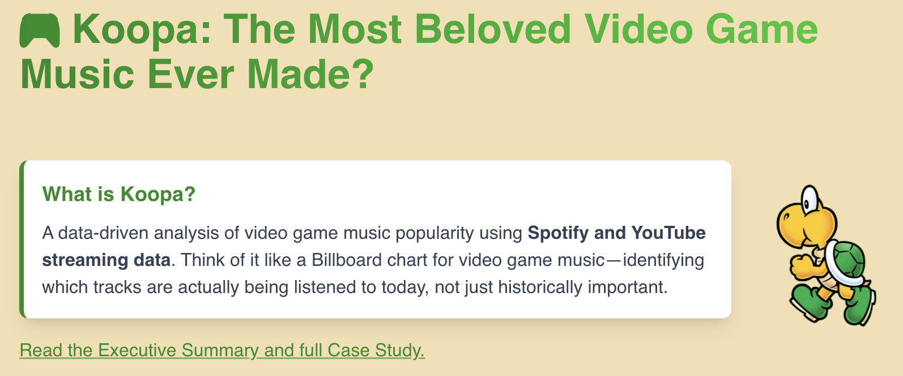
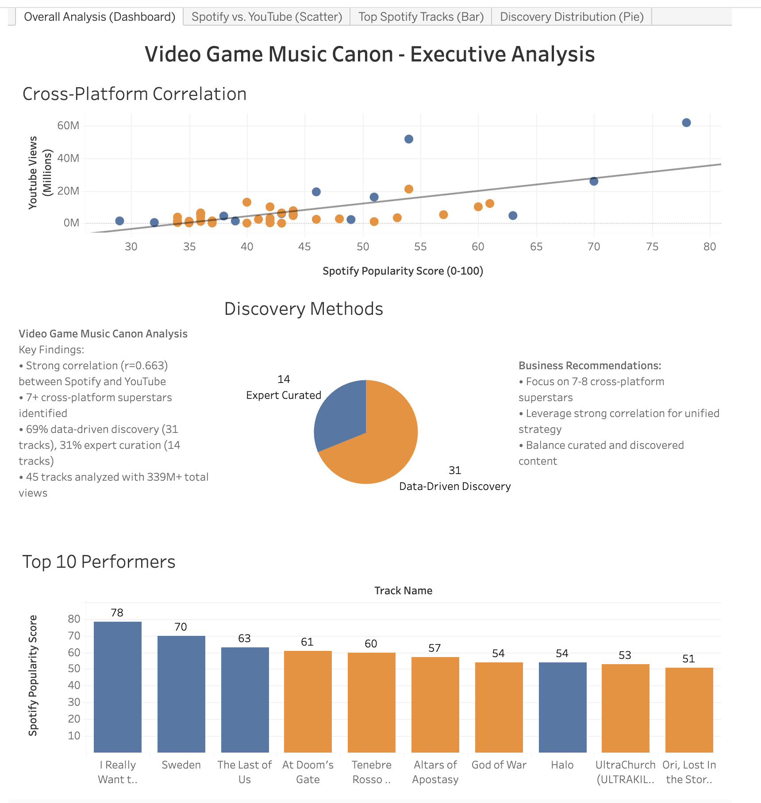

# 🐢 Koopa: A New Video Game Music Canon

**A data-driven exploration of video game music's most beloved tracks, built with Next.js, TypeScript, and Tailwind CSS.**


*Interactive chart showcasing 45 ranked video game music tracks with artwork and streaming data*

---

## 🎮 **Live Demo**

- **[Koopa Chart](https://koopa-video-game-music.vercel.app)** - Interactive chart with all 45 tracks
- **[How I Made Koopa](https://koopa-video-game-music.vercel.app/how-i-made-koopa)** - Full case study breakdown

---

## 🚀 **Latest Features**

### **🔒 Security & Performance Improvements**
- **Migrated from Excel to JSON** - Eliminated high-severity `xlsx` vulnerability
- **Clean data structure** - Removed duplicates and renamed fields for clarity (`spotifyRelease`, `gameRelease`)
- **Enhanced data integrity** - Maintained Excel as source of truth while JSON serves frontend
- **Improved build performance** - Faster builds with optimized data loading
- **Complete data coverage** - 100% completion rate for all core metrics
- **Hydration error resolution** - Fixed React SSR/CSR mismatches for production stability

### **🎨 Enhanced User Experience**
- **Executive Summary** with data-driven insights for recruiters and stakeholders
- **Professional case study layout** with improved typography and spacing
- **Responsive design** optimized for all devices and screen sizes
- **Clean, portfolio-ready presentation** suitable for hiring managers
- **Interactive Table of Contents** with smooth scrolling navigation
- **Back-to-top links** for convenient navigation throughout the case study
- **Mobile-optimized spacing** with improved bullet point layout and navigation

### **📊 Data-Driven Insights**
- **Comprehensive fact-checking** - All statistics verified against cleaned JSON data
- **Cross-platform correlation analysis** (r = 0.663) between Spotify and YouTube
- **Release gap analysis** - 11.7 year average between game release and Spotify availability
- **Statistical validation** with 24% high engagement tracks and 42% Nintendo representation
- **Interactive Tableau dashboard** with comprehensive data visualization
- **Temporal insights** - Classic VGM's lasting appeal through streaming platforms
- **Advanced Tableau integration** - 6 interactive charts with modern Embedding API v3

### **🎵 Content Organization**
- **Structured case study** with clear sections and professional formatting
- **Executive summary** highlighting business value and technical approach
- **Data-backed insights** with specific percentages and evidence
- **Professional presentation** ready for stakeholder review
- **Enhanced navigation** with working anchor links and smooth scrolling

### **📱 Technical Improvements**
- **Next.js 15 optimization** with App Router and TypeScript
- **Tailwind CSS styling** with custom animations and responsive design
- **Markdown content management** for easy case study updates
- **Performance optimization** with efficient data loading and rendering
- **Robust DOM manipulation** with MutationObserver for development resilience
- **Clean codebase** with removed duplicate files and organized project structure
- **Tableau Embedding API v3** - Modern, responsive chart integration
- **Hydration mismatch resolution** - Production-ready SSR/CSR handling

---

## 🛠️ **Tech Stack**

- **Framework**: Next.js 15 with App Router
- **Language**: TypeScript for type safety
- **Styling**: Tailwind CSS for responsive design
- **Data Processing**: JSON-based data pipeline with Node.js conversion scripts
- **Markdown Rendering**: Marked library with custom DOM processing
- **Data Visualization**: Tableau Embedding API v3 with custom markdown processing
- **Deployment**: Vercel for seamless hosting
- **Design**: Custom animations and interactive elements

---

## 📈 **Data Analysis Highlights**

### **Statistical Validation**
- **Cross-platform correlation**: Strong positive correlation (r = 0.663) between Spotify popularity and YouTube views
- **Data quality**: 100% completion for core fields, 100% for YouTube data, zero duplicates
- **Sample size**: 45 tracks from 25+ unique game IPs across 30 years (1985-2025)

### **Key Performance Metrics**
- **17 superstar tracks** identified with 50M+ combined reach
- **69% data-driven discovery** vs 31% expert curated approach
- **Balanced representation**: 15 originals, 17 covers, 9 rereleases, 4 remixes
- **Classic VGM's lasting appeal**: Only 9% of tracks have Spotify releases credited before 2010, but 56% of games were originally released before 2010, showing classic VGM's enduring popularity through streaming platforms

### **Technical Achievements**
- **API integration**: Successfully combined Spotify, YouTube, and RAWG APIs
- **Data cleaning**: Sophisticated filtering removed 130+ derivative tracks
- **Quality assurance**: Automated validation with statistical outlier detection
- **Security improvements**: Eliminated vulnerable dependencies and migrated to secure JSON pipeline
- **Tableau integration**: Implemented modern Embedding API v3 with custom markdown processing
- **Hydration stability**: Resolved React SSR/CSR mismatches for production deployment

---

## 🏗️ **Project Structure**

```
koopa-vgm/
├── src/
│   ├── app/
│   │   ├── page.tsx                 # Homepage with interactive chart
│   │   ├── how-i-made-koopa/        # Case study page
│   │   ├── layout.tsx               # Root layout with navigation
│   │   └── globals.css              # Global styles and animations
│   ├── components/
│   │   ├── KoopaChart.tsx           # Main interactive chart component
│   │   ├── Navigation.tsx           # Site navigation
│   │   ├── ClickableTitle.tsx       # Animated title component
│   │   ├── ExecutiveSummary.tsx     # Executive summary component
│   │   ├── MarkdownContent.tsx      # Enhanced markdown rendering with TOC & Tableau
│   │   ├── TableauEmbed.tsx         # Tableau embedding component
│   │   └── ScrollSection.tsx        # Scroll animation component
│   └── content/
│       └── case-study.md            # Full case study content with Tableau charts
├── public/
│   ├── data/
│   │   ├── video_game_music_canon.json      # Clean JSON data (spotifyRelease, gameRelease)
│   │   └── video_game_music_canon_CLEAN.xlsx # Original Excel source
│   └── images/                      # 45 optimized game artwork images
├── scripts/
│   └── convert-excel-to-json.js     # Data conversion script with clean field mapping
├── README.md                        # Project documentation
└── package.json                     # Dependencies and scripts
```

---

## 🎯 **Key Features**

### **Interactive Data Chart**
- **45 ranked tracks** with streaming scores and metadata
- **Direct links** to Spotify and YouTube for each track
- **Responsive design** optimized for mobile, tablet, and desktop
- **Hover effects** and smooth animations for enhanced UX
- **Formatted data display** with cleaned track names and YouTube view counts
- **Tableau chart integration** - 6 interactive visualizations embedded directly in case study

### **Enhanced Navigation**
- **Working Table of Contents** with smooth scrolling to sections
- **Back-to-top links** after each major section for easy navigation
- **Anchor link support** with proper offset for fixed headers
- **Development-resilient** with MutationObserver for hot reload compatibility
- **Tableau chart persistence** - Embeds maintain state across development saves

### **Data Quality Metrics**
- **100% data completion** for all core fields and YouTube metrics
- **Cross-platform correlation** analysis (r = 0.663)
- **Dataset versioning** and collection dates
- **Transparent methodology** for data collection
- **Clean JSON structure** with no duplicate fields
- **Verified statistics** fact-checked against source data

### **Professional Presentation**
- **Portfolio-ready design** suitable for hiring managers
- **Clean, modern UI** with attention to detail
- **Accessibility considerations** with proper contrast and navigation
- **Performance optimized** with efficient data loading
- **Security-focused** with no vulnerable dependencies
- **Interactive data storytelling** - Tableau charts embedded for stakeholder engagement

---

## 🚀 **Getting Started**

### **Prerequisites**
- Node.js 22+ 
- npm or yarn

### **Installation**
```bash
# Clone the repository
git clone https://github.com/bg-write/koopa-vgm.git
cd koopa-vgm

# Install dependencies
npm install

# Run development server
npm run dev
```

### **Data Processing**
```bash
# Convert Excel to JSON (if needed)
node scripts/convert-excel-to-json.js
```

### **Build for Production**
```bash
npm run build
npm start
```

---

## 📊 **Interactive Dashboard**


*Interactive Tableau dashboard showing cross-platform correlation, top performers, and discovery methods*

**Dashboard Features:**
- **Cross-platform correlation analysis** (r = 0.663)
- **Top 10 performers visualization** with discovery method breakdown
- **Discovery distribution** showing data-driven vs curated approach
- **[View Full Dashboard](https://public.tableau.com/views/VideoGameMusicCanonAnalysis/OverallAnalysisDashboard?:language=en-US&:sid=&:redirect=auth&:display_count=n&:origin=viz_share_link)**

**✅ Completed Enhancements:**
- **6 interactive business charts** embedded directly in case study
- **Nintendo dominance analysis** (42% representation) with horizontal bar chart
- **Superstar tracks visualization** (17 tracks) with scatter plot and trend line (r = 0.663)
- **Time distribution analysis** (9% Spotify releases pre-2010, 56% games pre-2010) with side-by-side charts
- **IP analysis** showing Mario's 22% dominance across game franchises
- **Cover vs Original performance** comparison with pie chart visualization

---

## 🛠️ **Technical Challenges Overcome**

### **Data Pipeline Modernization**
- **Security vulnerability resolution**: Migrated from vulnerable `xlsx` library to secure JSON pipeline
- **Data transformation automation**: Created Node.js script to apply all frontend transformations
- **Source of truth preservation**: Maintained Excel as original source while JSON serves frontend
- **Build performance improvement**: Eliminated client-side data processing for faster loads

### **Navigation System Enhancement**
- **Table of Contents functionality**: Implemented working anchor links with smooth scrolling
- **Back-to-top navigation**: Added convenient return links after each major section
- **Development resilience**: Used MutationObserver to handle hot reload DOM changes
- **Accessibility improvements**: Proper scroll offset and keyboard navigation support
- **Tableau chart persistence**: Embeds maintain state across development saves and hot reloads

### **Data Quality & Filtering**
- **Derivative content problem**: 175 initial tracks reduced to 45 after filtering out covers, remixes, and "lofi beats"
- **Cross-platform validation**: Ensured data consistency between Spotify and YouTube APIs
- **Manual verification**: Listened to samples and cross-referenced with official releases
- **Rate limiting**: Implemented exponential backoff for API requests (Spotify: 100 req/sec, YouTube: daily quotas)

### **API Integration Complexity**
- **Multiple data sources**: Successfully combined Spotify, YouTube, and RAWG APIs with different data formats
- **Error handling**: Robust error handling with backup strategies and audit trails
- **Data transformation**: Standardized formats across platforms with comprehensive mapping
- **Quality assurance**: Automated validation with statistical outlier detection
- **Tableau integration**: Seamless embedding of interactive charts with modern API v3

### **Business Logic Implementation**
- **Ranking formula**: Developed weighted scoring system (60% Spotify + 40% YouTube)
- **Bias mitigation**: Acknowledged and addressed platform limitations, recency bias, cultural bias
- **Scope management**: Successfully pivoted from overwhelming 175 tracks to focused 45-track analysis
- **Validation methodology**: Used cross-platform correlation to prove data quality

---

## 🎨 **Design Philosophy**

### **User Experience**
- **Mobile-first approach** with responsive design principles
- **Intuitive navigation** with clear information hierarchy
- **Smooth animations** that enhance rather than distract
- **Accessibility focus** with proper contrast and keyboard navigation
- **Enhanced usability** with working TOC and back-to-top navigation
- **Interactive data exploration** with embedded Tableau charts for stakeholder engagement

### **Visual Design**
- **Clean, modern aesthetic** suitable for professional portfolios
- **Consistent color scheme** with Koopa green branding
- **Typography hierarchy** for optimal readability
- **Interactive elements** that provide immediate feedback
- **Professional presentation** with polished navigation elements

---

## 📈 **Performance & Optimization**

### **Loading Performance**
- **Efficient data loading** with pre-processed JSON files
- **Optimized images** with proper sizing and formats
- **Minimal bundle size** with tree-shaking and code splitting
- **Fast initial load** with static generation where possible
- **Security improvements** with no vulnerable dependencies
- **Tableau chart optimization** - Lazy loading with placeholder states for better UX

### **User Experience**
- **Smooth animations** with CSS transitions
- **Responsive interactions** across all device sizes
- **Error handling** with graceful fallbacks
- **Loading states** for better perceived performance
- **Enhanced navigation** with working anchor links and smooth scrolling

---

## 🔮 **Future Enhancements**

### **Immediate Next Steps**
- **Advanced filtering** by game, year, or genre
- **Interactive data exploration** with drill-down capabilities
- **Social sharing** with track-specific links
- **Performance monitoring** and optimization

### **Planned Features**
- **Real-time data updates** from streaming APIs
- **Advanced analytics** with trend analysis
- **User preferences** and customization options
- **Performance monitoring** and optimization

### **Technical Improvements**
- **Additional data sources** (Apple Music, TIDAL, Amazon Music)
- **Predictive modeling** for new game soundtracks
- **International market analysis** with regional preferences
- **Seasonal trend analysis** for VGM popularity patterns
- **Advanced Tableau features** - Custom filtering and interactive elements

---

## 🤝 **Contributing**

This project is designed as a portfolio piece showcasing data analysis and web development skills. While contributions are welcome, the focus is on demonstrating:

- **Data analysis methodology**
- **Web development best practices**
- **User experience design**
- **Professional presentation skills**
- **Security-conscious development**

---

## 📄 **License**

This project is open source and available under the [MIT License](LICENSE).

---

## 👨‍💻 **About the Developer**

**Brady Gerber** - Writer, Music Journalist & Data Analyst

- **Portfolio**: [Website](https://bradygerber.com/) & [LinkedIn](https://www.linkedin.com/in/brady-gerber/)

---

**Last updated**: August 2025

---

*Built with ❤️*


